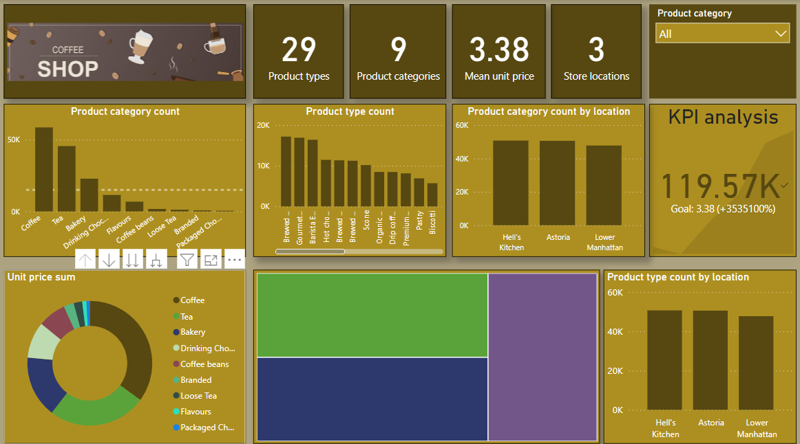

## **COFFEE SHOP SALES ANALYSIS**

This project was accomplished using two Microsoft Excel & Microsoft PowerBI. 

The original data can be found in **Coffee Shop Sales.xlsx**

Ms Excel was used for the following;
- To understand the dataset
- To create pivot tables for experimentation and initial analysis
- To create the working sheet for powerbi analysis

PowerBi was used for the following;
- This was solely used for the creation of a PowerBi report and present a visually appealing report suitable for customers, users and viewers.
- Tables were formed to first understand how each visual may be constructed
- Dummy visuals were also created to experiment with visuals and choose the best representation to give an elaorate story about the dataset.
- The final report can be seen in the powerbi file and the picture below

